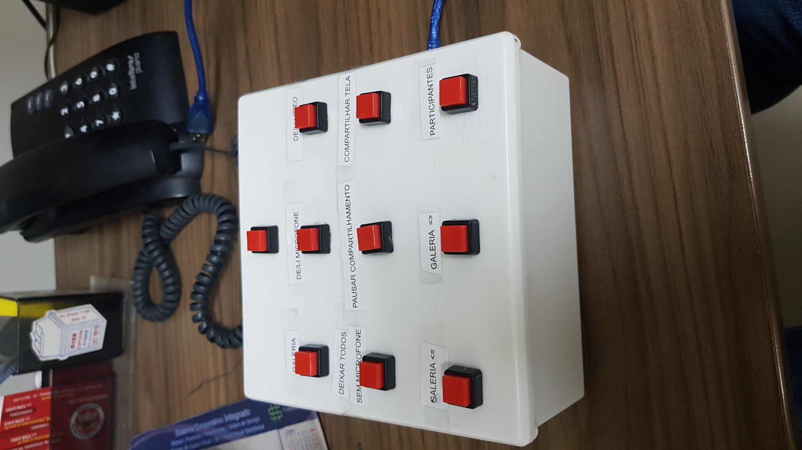

# ArduinoControleZoom

> Painel de Controle para Reuniões do zoom

Esse projeto tratasse da construção de um painel de boto~e configuraveis para reuniões no zoom, podendo colocar uma função em cada botão

## Primeira etapa
montagem dos botões na placa do arduino
pinagem usadas

GND conectado a todos boto~es
e
8,9,10,11,12,A0,A1,A2,A3,A4

## Segunda etapa

colagem ou soldagem dos fios nos boto~es

## Terceira etapa
finalização da caixa plastica

## Configuração para Desenvolvimento

intala IDE do arduino , congigurar para arduino leonardo, e enviar o cógigo
