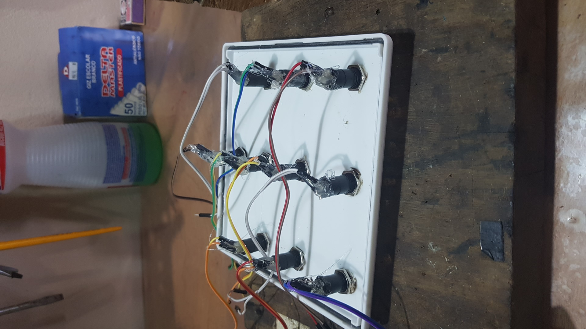

# ArduinoControleZoom

> Painel de Controle para Reuniões do zoom

Esse projeto tratasse da construção de um painel de boto~e configuraveis para reuniões no zoom, podendo colocar uma função em cada botão

## Instalação

Windows:

## Configuração para Desenvolvimento

intala IDE do arduino , congigurar para arduino leonardo, e enviar o cógigo
